# UAV-Based Wildfire Detection using RGB and Thermal Cameras

## 📘 Overview

This repository accompanies the diploma thesis **"UAV-Based Wildfire Detection using RGB and Thermal Cameras"** conducted at the University of Thessaly, Department of Electrical and Computer Engineering, under the supervision of Prof. Christos Antonopoulos.

The project presents the design, development, and evaluation of a **real-time, modular wildfire detection system** using **Unmanned Aerial Vehicles (UAVs)** equipped with **RGB and thermal cameras**. The system is tested in a simulated environment (Unreal Engine + AirSim) and is orchestrated via **ROS 2**. It incorporates **deep learning-based object detection**, **image registration**, **multi-modal data fusion**, **object tracking** and **GPS-based alerting**.

---

## 📚 Contents

- [📄 Files](#-files)
  - [Thesis.pdf](#thesispdf)
  - [Thesis-Presentation.pptx](#thesis-presentationpptx)
  - [📁 Folder Structure](#folder-structure)
  - [📦 Missing: Datasets & Unreal Engine Environment](#missing-datasets--unreal-engine-environment)
- [🔍 Key Features](#-key-features)
- [📦 Dataset Samples](#-dataset-samples)
  - [RGB Dataset Samples](#rgb-dataset-samples)
  - [Thermal Dataset Samples](#thermal-dataset-samples)
- [📊 Data Engineering Diagram](#-data-engineering-diagram)
- [🧠 System and ROS 2 Diagrams](#-system-and-ros-2-diagrams)
- [🔥 Real-Time Experiment Screenshots](#-real-time-experiment-screenshots)
- [📎 Related Links](#-related-links)
- [🛠 Technologies Used](#-technologies-used)
- [📌 Author](#-author)

---

## 📄 Files

### [`Thesis.pdf`](Thesis.pdf)
The **full written thesis** (in English) presenting the detailed methodology, implementation, experiments, results and future work.

It includes:
- Background on deep learning, UAVs, and multi-modal sensing
- Creation of custom datasets for RGB and thermal imagery
- Evaluation of object detection models (YOLOv8, Faster R-CNN with MobileNetV3, SSD with VGG16, EfficientDet D1)
- Optimization with TensorRT for deployment on NVIDIA Jetson Orin Nano and GeForce RTX 4090
- Full system architecture and implementation using ROS 2
- Simulation setup using Unreal Engine and AirSim
- Image alignment using calibration and homography
- Evaluation results and real-time demo video

### [`Thesis-Presentation.pptx`](Thesis-Presentation.pptx)
The **official thesis presentation slides**, summarizing the core contributions of the project, including:
- Motivation and objectives
- Dataset samples
- Training results and performance metrics
- Architecture diagrams and simulation screenshots
- Conclusions and future directions

---

### 📁 Folder Structure

- 📂 `scripts-preprocessing`  
  Contains the **data preprocessing scripts**, including image cropping, resolution adjustment, grayscale conversion for thermal images, data augmentation, label formatting, removal of low-quality or irrelevant samples and conversion to multiple object detection annotation formats (YOLO, Pascal VOC and COCO).

- 📂 `models-training`  
  Includes **training scripts**, model configuration files, **training logs**, benchmark results and **TensorRT optimization code** (e.g. FP16/INT8 conversions).

- 📂 `scripts-for-drone`  
  Holds **ROS 2 nodes and launch files** for running the UAV detection system, along with the **image registration pipeline** and integration with object detection and tracking.

- 📂 `readme_images`  
  Stores all the visual content used in this README, such as dataset examples, architectural diagrams and real-time simulation screenshots.

---

### 📦 Missing: Datasets & Unreal Engine Environment

> ⚠️ **Note**: The **custom RGB and thermal datasets**, along with the **Unreal Engine simulation environment** created for this thesis, are **not included** in this repository due to their large size (**over 80 GB** combined).  
>  
> If you are interested in accessing these files, please contact the author.

---

## 🔍 Key Features

- 🔥 **Wildfire detection** using both RGB (fire/smoke) and thermal (fire/humans/animals) modalities
- 📦 **Custom datasets** built from real and synthetic sources
- 📈 **Model comparison** with benchmarks on accuracy, inference speed and resource usage
- 🧠 **Real-time inference** on NVIDIA Jetson Orin Nano and GeForce RTX 4090 using TensorRT optimizations (FP16 & INT8)
- 🎥 **Simulation environment** with realistic fire, smoke, humans and animals in Unreal Engine
- 📐 **Image registration pipeline** for frame-level alignment of RGB and thermal inputs
- 🎯 **Object tracking** for persistent multi-frame detection and reduced alert redundancy
- 📡 **GPS-enabled alerting** and visualization
- 🧱 **ROS 2-based modular architecture** supporting scalability and extensibility

---

## 📦 Dataset Samples

RGB and Thermal dataset examples used for training:

### RGB Dataset Samples

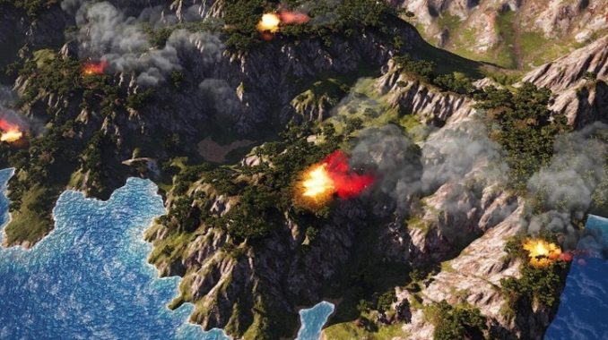
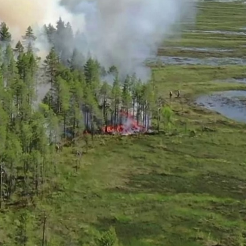
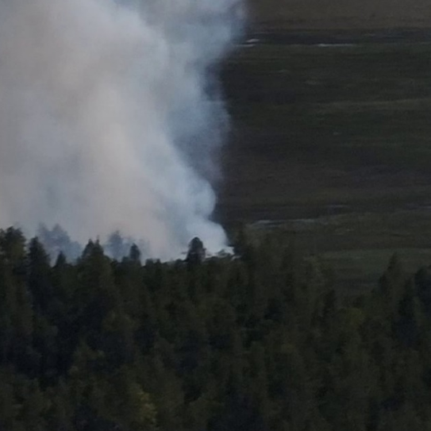
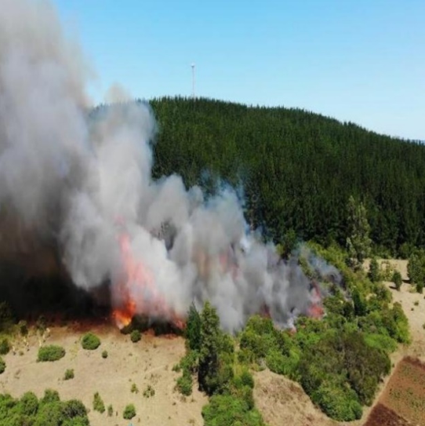

### Thermal Dataset Samples

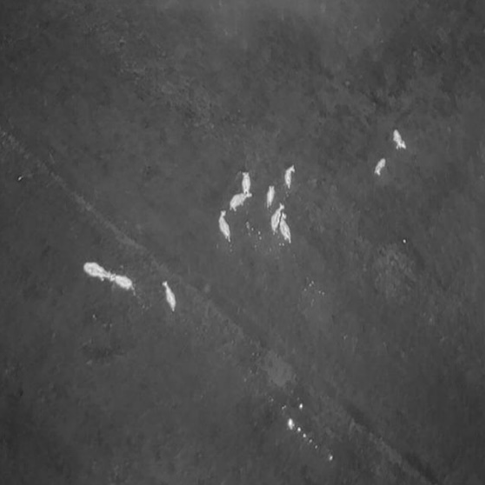
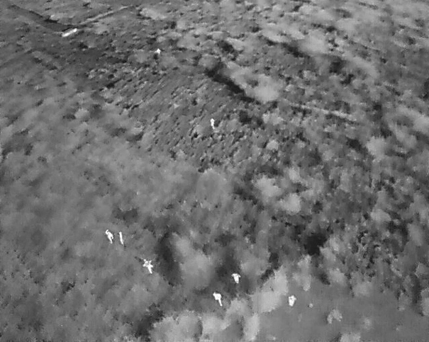
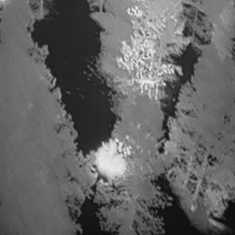
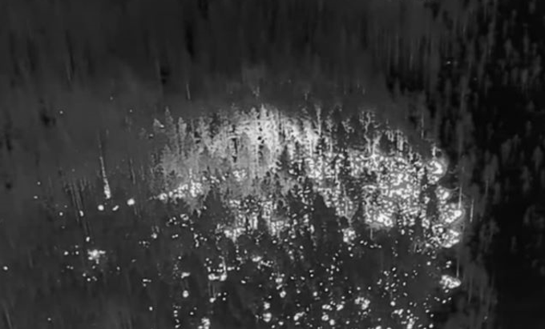

---

## 📊 Data Engineering Diagram

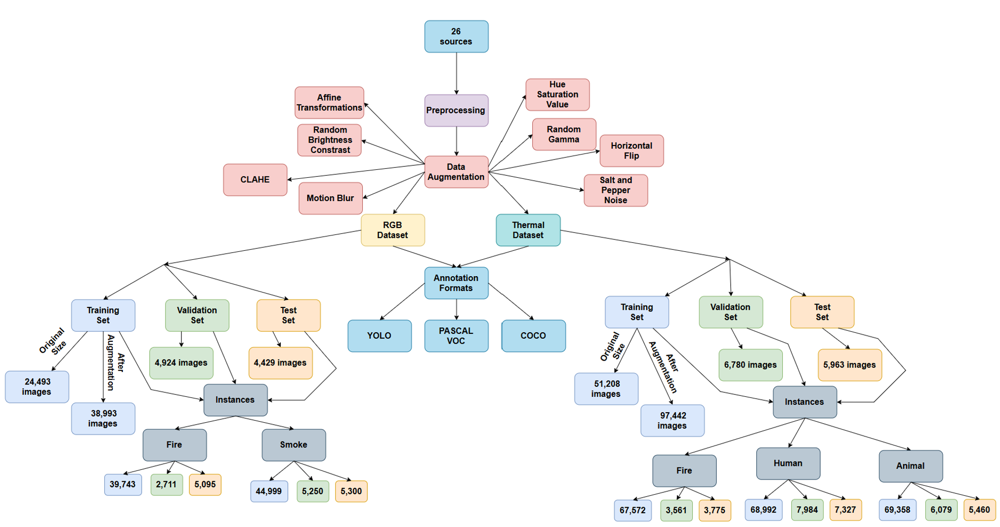

---

## 🧠 System and ROS 2 Diagrams

System and ROS 2 overview:

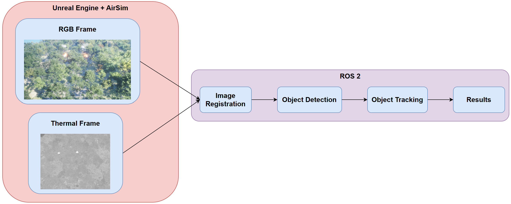
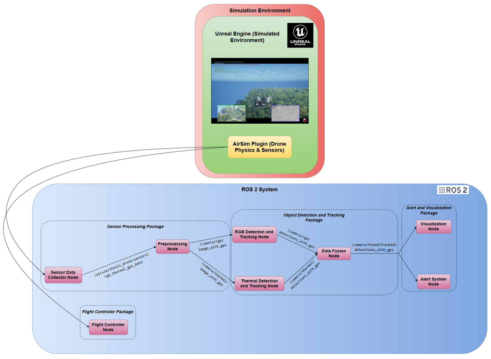

---

## 🔥 Real-Time Experiment Screenshots

Here are sample frames from real-time inference during simulation:

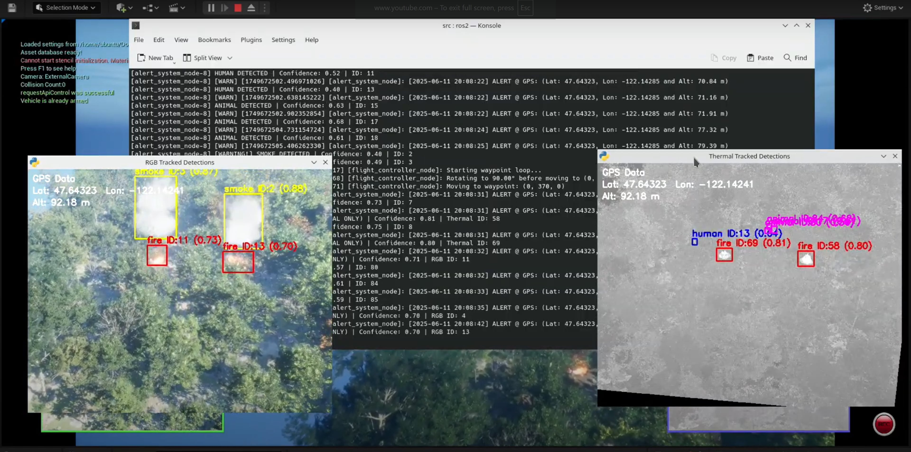
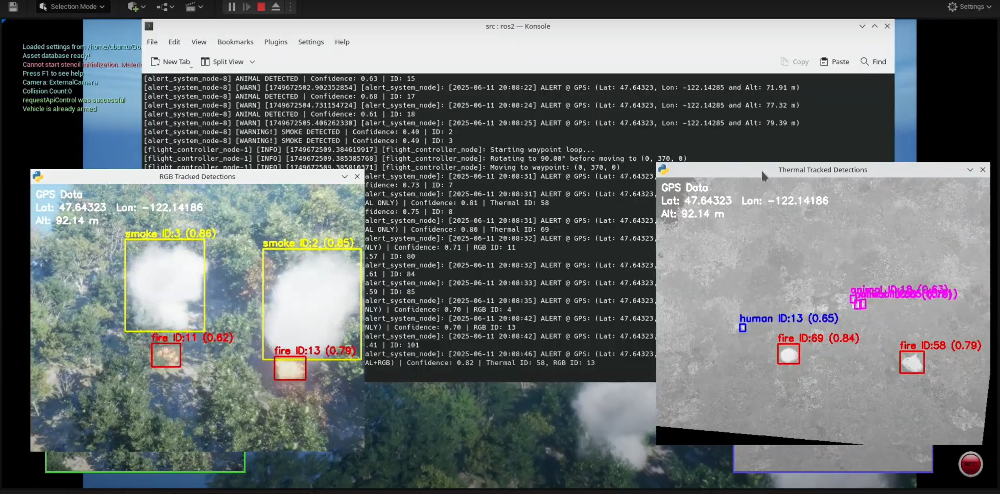
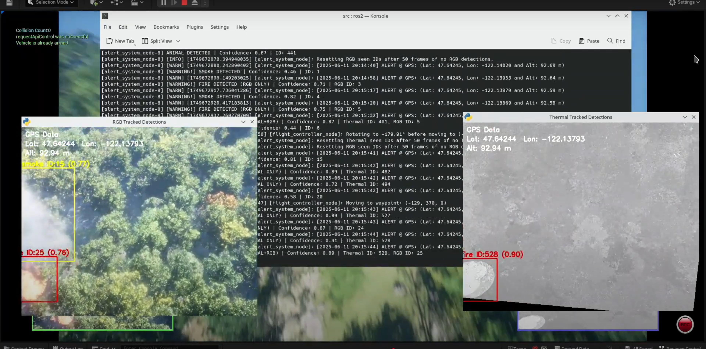
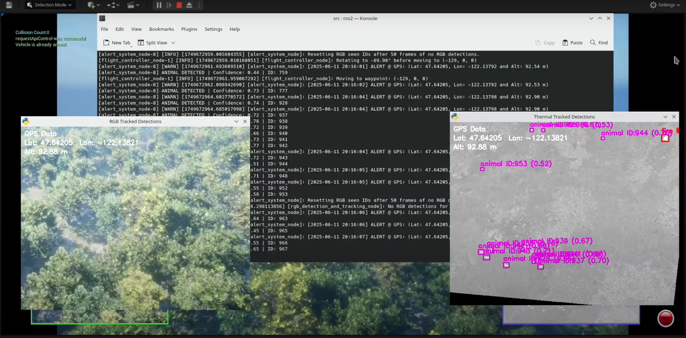
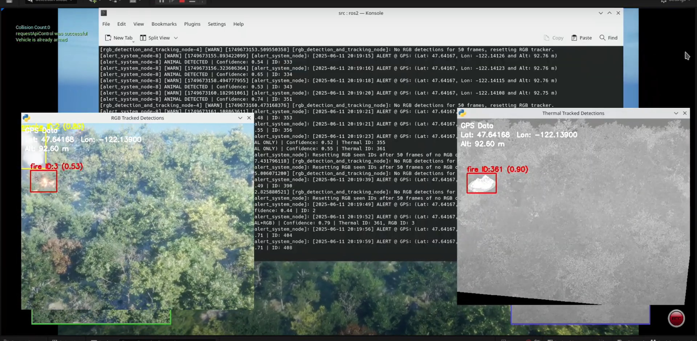
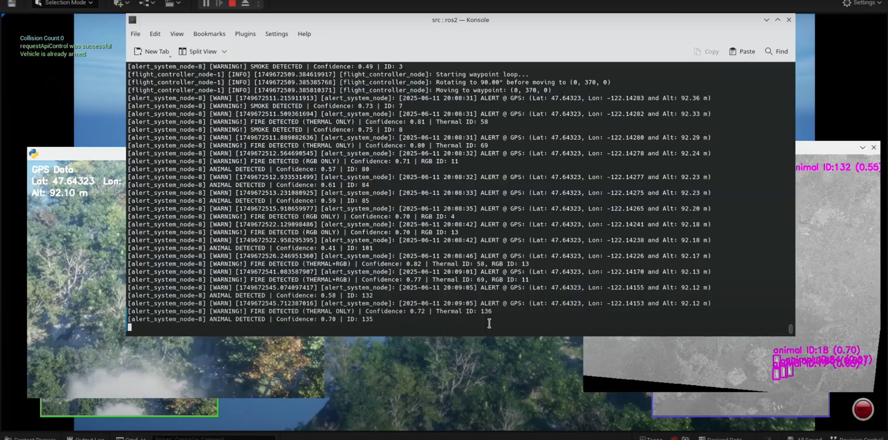
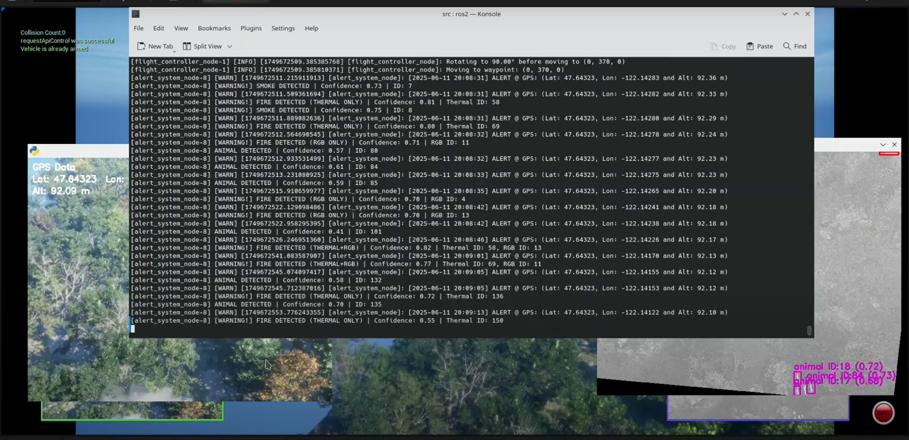

---

## 📎 Related Links

- 🎥 [System Demo Video](https://youtu.be/7VyGpnn9aZ4)
- 📂 [Source Code Repository](https://github.com/vasilisanagno/UAV-Based-Wildfire-Detection-using-RGB-and-Thermal-Cameras)

---

## 🛠 Technologies Used

- Python, PyTorch, OpenCV, TensorRT
- ROS 2 (Iron)
- Unreal Engine 5 + AirSim
- NVIDIA Jetson Orin Nano, GeForce RTX 4090
- YOLOv8, Faster R-CNN with MobileNetV3, SSD with VGG16, EfficientDet D1
- DeepSORT, ByteTrack, BoT-SORT-ReID

---

## 📌 Author

**Vasileios Anagnostopoulos**

University of Thessaly, Department of Electrical and Computer Engineering (ECE)

Supervisor: Prof. Christos Antonopoulos

July 2025

---

